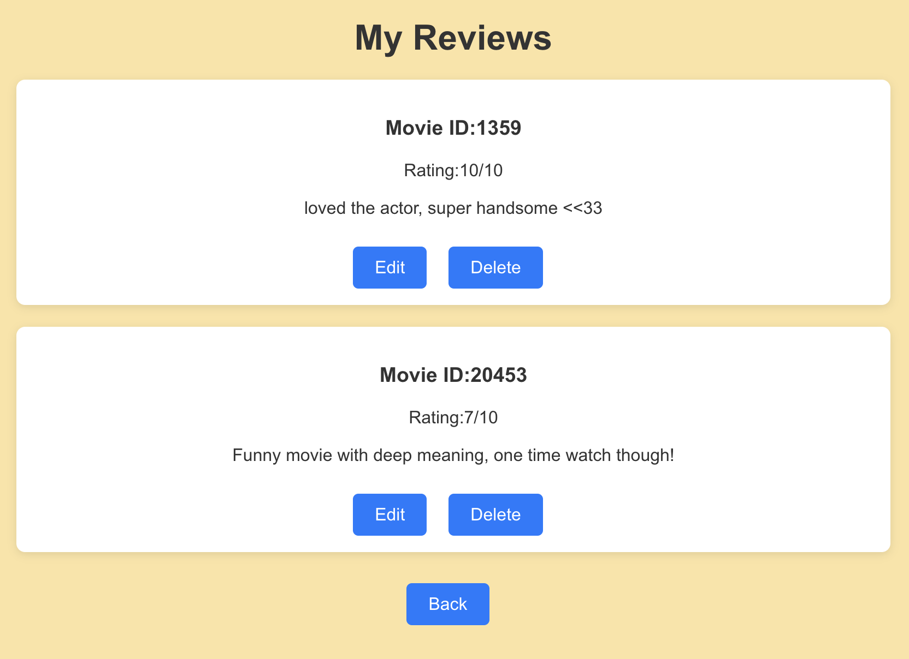

# Movie Discovery Web App (with user reviews!)
This web app has a signup/login system that randomly displays one of my favorite movies and allows user to provide reviews and ratings, while also viewing others' reviews<br>
NEW Feature: Users can now view/edit/delete their reviews!
---

<p align="center">
  
  
</p>


## Features:
<ul>
  <li>Uses <b>Flask</b> as backend and <b>React.js</b> as frontend</li>
  <li>Allows <b>users to manipulate/delete their movie reviews</b> after they login to their account</li>
  <li>Displays <b>movie details</b> left side and its <b>corresponding review section</b> on right side</li>
  <li>Clicking "My Reviews" button reveals all the reviews provided by the user</li>
  <li>Tools for creating user login: Flask-JWT, Flask-Bcrypt </li>
  <li>Tools for Database management: Flask-SQLAlchemy, postgresql, psycopg2-binary, deployed on locally using npm </li>
  <li>APIs used: The Movie Database API for movies and MediaWiki API for Wikipedia links</li>
  <li>Code-editor used: VSCode</li>
</ul>

## How to use this repository?
### Step 1: Clone this repository
Run the command below in your terminal
```sh 
git clone https://github.com/cs540-s25/milestone3-skaush7.git
```
---
### Step 2: Install dependencies
This app uses Python 3.10+, make sure to create a virtual environment that satisfies the required Python version.<br>
Next, install the required dependencies as follows: 
```sh
pip install -r requirements.txt
``` 
---
### Step 3: Obtain API key and Set-up environment variables
Create a .env file in the backend folder of the project directory to securely store the API keys. 
```sh
touch .env
```
Create an account at [The Movie Database](https://developer.themoviedb.org/docs/getting-started) and get your TMDB API Key. Open the previously created .env file and enter your api key as follows:
```sh
TMDB_API_KEY=your_tmdb_api_key
```
This file is included in .gitignore to prevent sharing/committing the api keys.

---
### Step 4: Create a secret key for Flask and update the SQLAlchemy_Database_URI
Flask and JWT both requires their own secret keys for proper functioning of the app. To generate a secret key, open terminal and type in the following command:
```python
python -c "import secrets; print(secrets.token_hex(32))"
```
Copy the random secret key generated and add it to .env file as SECRET_KEY for Flask and a different random key as JWT_SECRET_KEY.

Navigate to <code>config.py</code> file in backend directory and replace the placehoders in <code>SQLAlchemy_Database_URI</code> with your <code>psql</code> username, password, and database

---
### Step 5: Setting up React (frontend folder) -- Important
<ol>
  <li>To use React, first install Node as follows:
    <ul>
      <li>For mac, use command <code>brew install node</code></li>
      <li>For others, refer to documentation: https://docs.npmjs.com/downloading-and-installing-node-js-and-npm </li>
    </ul>
  </li>
  <li>Navigate to project folder and rename the <code>frontend</code> folder that you cloned from this repo (to sample-frontend, for e.g.)</li>
  <li> Once done, run command <code>npx create-react-app frontend</code>. This creates the <code>frontend</code> folder for the app.</li> 
  <li>Copy the contents of the <code>sample-frontend</code> folder and paste them into the React <code>frontend</code> folder, replacing the duplicate files in <code>frontend</code></li>

</ol>

---
### Step 6: ESLint
[ESLint](https://eslint.org/) is a tool to analyse the javascript codes for errors and warnings, and offers automatic fixes and suggestions for code enhancibility.
<ol>
  <li>While using VSCode, install the ESLint extension by Microsoft</li>
  <li>Navigate to frontend folder in terminal and run the following commands:
    <ul>
      <li><code>npm install eslint —-save-dev</code></li>
      <li><code>npx install-peerdeps --dev eslint-config-airbnb</code></li>
      <li><code>npx eslint --init</code></li>
      <li>If you see a flat config file <code>eslint.config.mjs</code>, you can either choose to edit that or delete the file and create a json file instead; this project does the latter.</li>
    </ul>
  </li>
  <li>After running npx eslint --init command, create a new file <code>.eslintrc.json</code> and paste the following:
    
```json
{
    "env": {
      "browser": true,
      "node": true
    },
    "extends": [
      "airbnb",
      "airbnb/hooks",
      "plugin:react/recommended"
    ],
    "plugins": [
      "react"
    ],
    "rules": {
      "react/no-array-index-key": "off",
      "react-hooks/exhaustive-deps": "off",
      "react/jsx-filename-extension": "off"
    }
  }
  
```
</li>
<li>Create another file named <code>.eslintignore</code> and paste the following to ignore all the files in react that are not modified by you:
    
```sh
#test files
*.test.js
*.test.jsx
*.spec.js
*.spec.jsx

#these files too
setupTests.js
reportWebVitals.js
index.js

  
```
</li>
<li>Running the command <code>npx eslint .</code> should return nothing, since all the errors/warnings are already handled using <code>npx eslint . --fix</code> and the rest by manual edits</li>
</ol>

---
### Step 7: Local Deployment
This app is deployed by running flask and npm in two different terminals.

<ol>
  <li>Open terminal at project directory, navigate to the backend folder and run <code>flask run</code> command</li>
  <li>Open another terminal at project directory, and this time, navigate to frontend folder and run <code>npm start</code> command</li>
  <li>Your web app will start on your browser with login page. Create users and have fun with the application! </li>
</ol>


## Author
[Shoibolina Kaushik](https://www.linkedin.com/in/shoibolina-kaushik/)<br>
<sub>Master of Science, Computer Science (25G)<br>
Emory University</sub>
